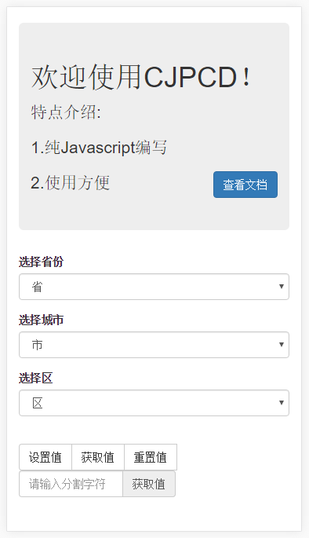
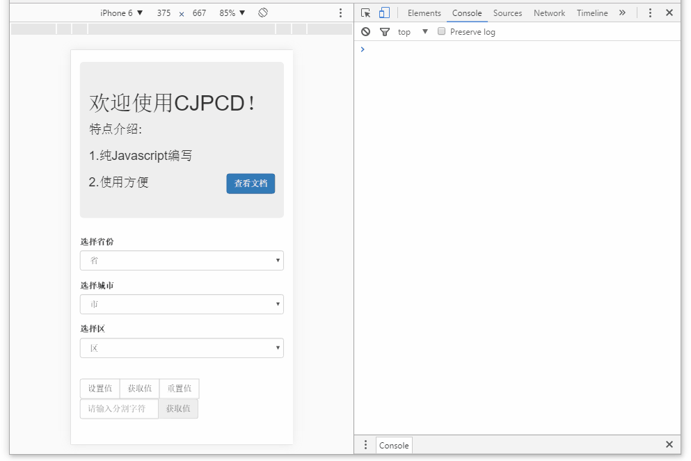

#### 简介
	
CJPCD 是一款原生开源的 javascript 插件，用于生成省市区选择器，基本用法十分简单。

#### 使用方法

最简单的使用只需要两个步骤：

1. 放置容器，引入依赖

		<!--存放省市区数据的三个 select-->
		<select id="province"></select>
		<select id="city"></select>
		<select id="district"></select>
		
		<!--引入插件-->
		

2. 调用方法

 		var pcd = new CJPCD('province','city','district');

     效果如下图

	

#### API

1. 初始化
	
		/**
			provinceId ：省份 select id
			cityId     ：城市 select id
			districtId ：县区 select id
		*/
   		var pcd = new CJPCD(provinceId,cityId,districtId);

2. 设置初始值
		
		/**
			provinceName ：省份名称
			cityName     ：城市名称
			districtName ：县区名称
		
			注意：前提是必须初始化
		*/
		pcd.setUp('provinceName','cityName','districtName');

	eg：

		var pcd = new CJPCD('provinceId','cityId','districtId');//先初始化
		pcd.setUp("广东省","广州市","越秀区");//设置值	

	使用场景:设置值一般用于地址信息的修改

3. 重置

		pcd.reSet();

4. 获取值
   
		pcd.getValue('json');//指定以json对象返回
		pcd.getValue();//默认以json对象返回,效果同上

	 json 对象返回如下：
	
		{"province":"广东省","city":"广州市","district":"越秀区"};

	指定拼接成一定格式的字符串进行返回,以逗号为例(当然也可以使用其他字符串)
	
		pcd.getValue(',');//结果使用逗号拼接成字符串

	返回值如下
		
		"广东省,广州市,越秀区"
5. 补充说明

	如果业务中涉及多组地址选择,请创建多个 CJPCD 实例 如
	
		var pcd1 = new CJPCD(provinceId1,cityId1,districtId1);
		var pcd2 = new CJPCD(provinceId2,cityId2,districtId2);
		...
		var pcdn = new CJPCD(provinceIdn,cityIdn,districtIdn);
	
	
	使用案例如下:
	
	